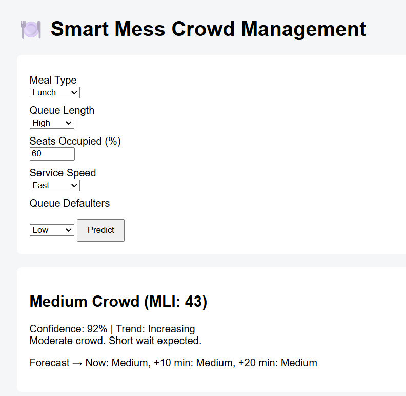
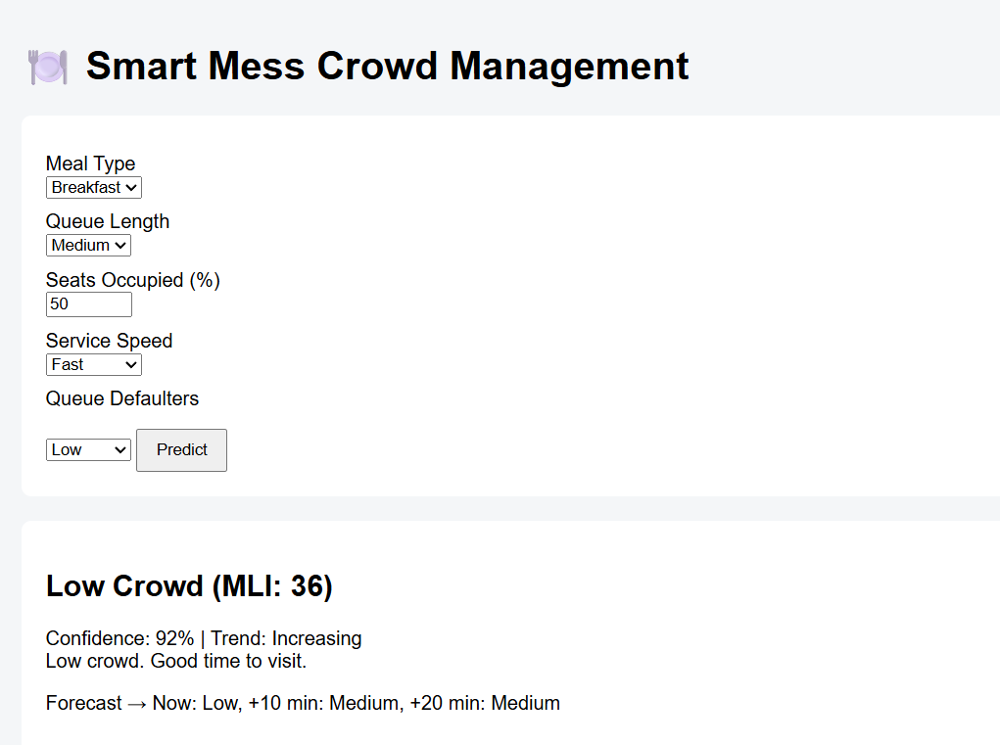
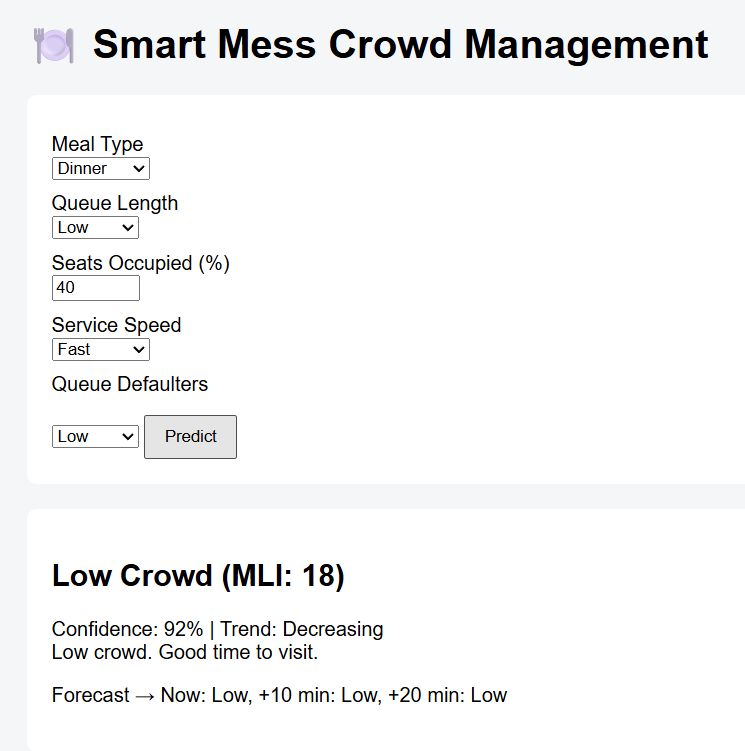

# Smart Mess Crowd Management System
### Prototype V3 — Adaptive, Meal-Aware & Uncertainty-Driven

---

## Overview
Campus mess facilities frequently experience severe congestion during peak hours. This congestion is not caused only by the number of students, but by a combination of fixed seating capacity, batch food preparation, service bottlenecks, and human behavior.

This project proposes a realistic, systems-engineering–driven solution that predicts mess congestion and provides actionable guidance to students under uncertainty — without increasing mess staff workload.

---

## 📸 Prototype Screenshots

### High Congestion Scenario

### Medium Congestion Scenario

### Low Congestion Scenario

### Short-Term Forecast View

---

## Problem Statement
- Fixed seating capacity (~100 seats) limits throughput
- Single serving counter with parallel queues
- Batch cooking (parathas / rotis) causes service variability
- Queue defaulters disrupt flow
- Peak demand is concentrated in short time windows
- Existing crowd handling is manual and reactive

---

## Objectives
- Predict congestion realistically, not optimistically
- Model real mess constraints instead of ideal assumptions
- Provide short-term forecasts and confidence levels
- Enable students to decide when to visit the mess
- Avoid continuous human supervision

---

## System Evolution
- V1 — Time-based crowd indicator
- V2 — Meal-aware, capacity-aware congestion model
- V3 (Current) — Adaptive, uncertainty-aware decision support system

---

## System Architecture (V3)

Meal Context  
↓  
Automatic System Signals  
↓  
Mess Load Index (MLI)  
↓  
Crowd Level + Confidence  
↓  
Short-Term Forecast & Recommendation  

---

## System Flow Map (End-to-End)

User opens app  
↓  
Meal type identified (Breakfast / Lunch / Dinner)  
↓  
Automatic system signals activated  
(Time, seating, service speed, disruptions)  
↓  
Mess Load Index (MLI) computation  
↓  
Crowd classification (Low / Medium / High)  
↓  
Confidence estimation  
↓  
Short-term forecast (+10 / +20 minutes)  
↓  
Scenario risk analysis (best / worst case)  
↓  
Actionable recommendation displayed  

---

## Mess Load Index (MLI)
Crowd pressure is modeled using a composite index ranging from 0 to 100 instead of binary states.

### Inputs Modeled
- Queue length
- Seating occupancy
- Service speed (batch cooking / food availability)
- Human disruptions (queue defaulters)

---

## Meal-Aware Congestion Modeling

### Breakfast
- Batch-driven (paratha preparation)
- Service speed is the dominant bottleneck
- Rice/roti distinction disabled

### Lunch & Dinner
- Mixed service (rice + roti)
- Service heterogeneity enabled
- Seating saturation has higher impact at dinner

The system automatically switches congestion models based on meal type.

---

## Advanced Features in Prototype V3

### Short-Term Time Horizon Forecasting
The system estimates congestion for:
- Current time
- +10 minutes
- +20 minutes

This allows students to plan arrival time rather than reacting late.

---

### Scenario-Based Risk Analysis
Instead of relying on a single estimate, the system internally evaluates:
- Best-case scenario
- Average-case scenario
- Worst-case scenario

Recommendations are conservative and safety-oriented.

---

### Capacity Saturation Trigger
When seating occupancy exceeds 85 percent, the system automatically prioritizes seat turnover over queue length, reflecting real throughput limits.

---

### Minimal Admin Intervention
The system is designed to avoid continuous staff involvement.

- Predictions run automatically under normal conditions
- Mess staff do not monitor dashboards
- Manual input is required only during rare abnormal events such as:
  - Batch cooking delays
  - Equipment failure
  - Sudden surges

Admin interaction is limited to a single-tap override, not continuous supervision.

---

### Uncertainty & Confidence Modeling
Predictions include a confidence score, which decreases under:
- High service variability
- Frequent queue disruptions

The system communicates uncertainty transparently instead of forcing false precision.

---

### Operational Metrics & Feedback Loop (Future-Ready)
Planned metrics include:
- Peak congestion duration
- Average waiting time
- Seat turnover rate
- Prediction error drift

These enable gradual tuning without premature ML deployment.

---

## Why Machine Learning Is Not Used (Yet)

Machine learning is intentionally deferred, not rejected.

Reasons:
- No historical labeled data (cold-start risk)
- High noise due to human behavior and batch cooking
- Need for explainable, trust-based decisions
- Rule-based models perform better in early deployment

Planned ML integration:
- Service rate prediction
- Peak window detection
- Adaptive weight tuning

The architecture is ML-ready by design.

---

## Technology Stack
- Web-based prototype (HTML, CSS, JavaScript)
- Google Cloud architecture (planned)
- Firebase / Firestore (planned backend)
- BigQuery (future analytics)

---

## Ethics & Privacy
- No individual tracking
- All inputs are aggregated
- No surveillance or identification
- Transparent system behavior

---

## Expected Impact
- Reduced peak-hour congestion
- Improved student experience
- Safer mess operations
- Data-driven decision support

---

## Conclusion
This project demonstrates how systems thinking, rather than blind automation, leads to deployable solutions. By embracing uncertainty, capacity constraints, and human behavior, the system provides realistic and actionable guidance for everyday campus life.

---

## Author Contribution
- Problem identification
- Systems modeling
- Architecture design
- Prototype logic
- Ethical framing

---

## Project Structure

mess-crowd-v3/
├── index.html # Main UI
├── style.css # Styling
├── script.js # Core prediction logic
├── README.md # Project documentation
├── LICENSE # MIT License
└── screenshots/
├── high_crowd.png
├── medium_crowd.png
├── low_crowd.png
└── forecast.png

---

## Prototype Status
- Core prediction engine implemented
- Meal-aware switching active
- Uncertainty and forecasting enabled
- Ready for deployment extension
